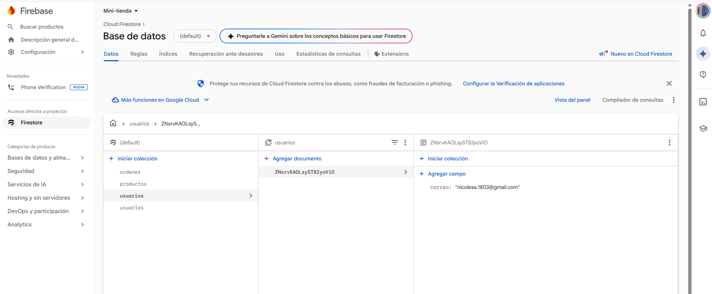

# 🌸 BLOOM - Mini Tienda en Línea

Proyecto Final del curso **React Fundamentos** - Universidad Galileo 2026

Una mini tienda en línea de ramos de flores estilo coreano, desarrollada con React y Firebase.

---

## 🛠️ Tecnologías utilizadas

- **React 19** con Vite
- **React Router DOM** para navegación entre vistas
- **Firebase Firestore** como base de datos
- **Tailwind CSS** para los estilos

---

## 📋 Funcionalidades

### 🔐 Login
- Ingreso mediante correo electrónico
- Si el correo ya existe en Firestore, redirige al catálogo
- Si el correo es nuevo, lo registra en la colección `usuarios`
- Guarda el ID del usuario en `localStorage` para mantener la sesión
- Si ya hay sesión activa, redirige automáticamente al catálogo

### 🛍️ Catálogo de Productos
- Muestra todos los productos registrados en Firestore
- Cada producto incluye imagen, nombre y precio
- Permite seleccionar la cantidad de cada producto
- Botón para agregar productos al carrito
- Contador de productos en el carrito en tiempo real

### 🛒 Carrito de Compras
- Lista todos los productos agregados con su cantidad
- Calcula el subtotal por producto automáticamente
- Muestra el total general de la orden
- Permite eliminar productos individuales del carrito
- Botón "Ingresar orden" que guarda el pedido en Firestore
- Mensaje de confirmación al registrar la orden exitosamente

### 📦 Mis Órdenes
- Muestra todas las órdenes realizadas por el usuario activo
- Filtra las órdenes por `usuarioId` desde Firestore
- Muestra imagen, nombre y precio de cada producto por orden
- Calcula el total de cada orden

---

## Base de datos en Firestore

### Colección `productos`
| Campo | Tipo |
|-------|------|
| nombre | string |
| precio | double |
| imagen | string |

### Colección `usuarios`
| Campo | Tipo |
|-------|------|
| correo | string |

### Colección `ordenes`
| Campo | Tipo |
|-------|------|
| productos | string (JSON) |
| usuarioId | string |

---

## Colecciones en Firebase

### Productos, Usuarios y Ordenes

---

Desarrollado por Nicole — Universidad Galileo 2026